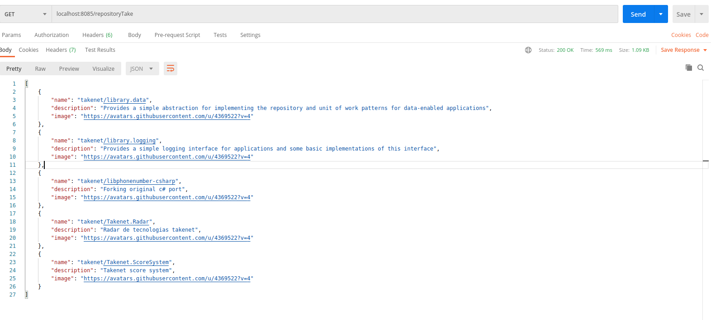

</p>
<h1 align="center">
Desafio TakeBlip
</h1>

<h4 align="center">
  🤖 API para o ChatBot Lora
</h4>

> Status do Projeto: Concluído :heavy_check_mark:

### Tópicos

:small_blue_diamond: [Sobre o desafio](#-sobre-o-desafio)

:small_blue_diamond: [Resultado esperado do desafio](#resultado-esperado-do-desafio)

:small_blue_diamond: [Formato do arquivo JSON](#-formato-do-arquivo-json)

:small_blue_diamond: [Como executar o Projeto](#como-executar-o-projeto)

:small_blue_diamond: [Tecnologias](#-tecnologias)

:small_blue_diamond: [Links Uteis](#links-uteis)

:small_blue_diamond: [Licença](#licença)

---

## 🤖 Sobre o desafio

## O desafio sugere a criação de um chatbot(Lora), que apresenta a cultura Take, contendo 6 tópicos de extrema importância para todos os colaboradores da empresa. Ainda deve ser criada uma API intermediaria que faz a comunicação com o repositorio da Take mostrando carrosel os 5 projetos mais antigos da empresa em C#.

## Resultado esperado do desafio

- [x] Seguir o fluxo conversional apresentado na documentação do desafio.
- [x] Criação de uma api intermediaria que faz a comunicação do chatbot com o Github
- [x] Fluxo do bot deve ser anexado junto com o projeto em um arquivo JSON.
- [x] Fazer deploy da aplicação e enviar o link do repositório para avaliação.

---

## 🎨 Formato do arquivo JSON

<h3> O arquivo JSON foi tratado para que o endpoint da api retorne com as três informações necessárias para inclusão do card no carrossel.
Com auxilio do Postman solicitei uma requisição get na api em localhost para a verificação do retorno Json da API. </h3>



<h3>Explicação do JSON de saida da API:</h3>

```json
{
  "0": {
    "name": "takenet/library.data",
    "description": "Provides a simple abstraction for implementing the repository and unit of work patterns for data-enabled applications",
    "image": "https://avatars.githubusercontent.com/u/4369522?v=4"
}
{
  "0": {
    "name": "nome do projeto",
    "description": "Descrição do projeto",
    "image": "imagem do projeto"
},
```

---
## Como executar o Projeto

```bash

$ cd desafiotake
# Vá para a pasta src
$ cd src
# Instale as dependências
$ npm install
# Execute a aplicação em modo de desenvolvimento
$ node index.js
# O servidor inciará na porta:8085 - acesse http://localhost:8085

```
---

## 🛠 Tecnologias

As seguintes ferramentas foram usadas na construção da API:

- **[NodeJS](https://nodejs.org/en/)**
- **[Cors](https://expressjs.com/en/resources/middleware/cors.html)**
- **[Axios](https://github.com/axios/axios)**
- **[Express](https://expressjs.com/)**
- **[Nodemon](https://www.npmjs.com/package/nodemon)**

---

## Links Uteis

- [x] Link do deploy da api feito pelo Heroku: <a href="https://takeblipapi.herokuapp.com/repositoryTake">Deploy da Api</a>
- [x] Link do BotLora na plataforma TakeBlip: <a href="https://cairo-cruz-25qx5.chat.blip.ai/?appKey=bXlib3Q0MjpmNmNiYTBlYS00YWMyLTQ0YmMtYTE2Zi1jYWJhM2YzYWEyZjY=">Chatbot para teste</a>

---

## Licença

The [MIT License]() (MIT)

Copyright ©️ 2021
```
